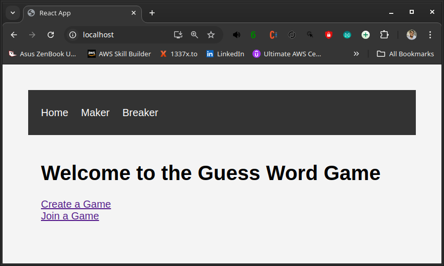

# Documentação do Projeto

## Pré-requisitos

Para rodar este projeto, certifique-se de ter os seguintes itens instalados:

- **Docker**: https://docs.docker.com/engine/install/
- **Docker Compose**: https://docs.docker.com/compose/install/
- **Git**: https://git-scm.com/book/en/v2/Getting-Started-Installing-Git

---

## **Git**:
O repositório já deve ter sido clonado para o seu ambiente. Caso não tenha feito isso, execute o seguinte comando:

  ```bash
  git clone https://github.com/gricardo87/projeto-docker-v1.git
  ```
  
Após clonar o repositório, navegue até a pasta correspondente:

  ```bash
  cd projeto-docker-v1
  ```
Depois, execute:

```bash
docker-compose up
```

Você pode acessar a aplicação a partir de sua máquina utilizando o link do localhost na porta 80: http://localhost.

Você devera vistualizar uma pagina como essa abaixo:



---

## Estrutura do Repositório

- **Arquivo Docker Compose:** Localizado na raiz do projeto. Nome: `docker-compose.yml`
- **Dockerfile do Backend (Python):** Localizado na raiz do projeto. Nome: `Dockerfile`
- **Dockerfile do Frontend (React):** Localizado na pasta `frontend`. Nome: `frontend/Dockerfile`
- **Configuração do NGINX:** Localizado na raiz do projeto. Nome: `nginx.conf`

---

## Configuração e Estrutura

### 1. Arquivo `docker-compose.yml`

O arquivo `docker-compose.yml` foi configurado para conter todos os serviços necessários para iniciar o sistema.

#### 1.1. Frontend

Foi criado um **Dockerfile** específico para o frontend dentro da pasta `frontend`, separado do backend para facilitar atualizações. No arquivo `docker-compose.yml`, o serviço frontend é configurado para realizar o build utilizando o contexto da pasta `frontend`:

```yaml
frontend:
  build:
    context: ./frontend
    dockerfile: Dockerfile
  restart: always
  environment:
    - REACT_APP_BACKEND_URL=http://localhost
  depends_on:
    - guess
```

### 1.2. Backend (Serviço Guess)

O backend é representado pelo bloco `guess`, que contém um `Dockerfile` específico localizado na raiz do projeto. As variáveis de ambiente, que anteriormente estavam codificadas diretamente no código, foram movidas para o arquivo `docker-compose.yml`. 

Adicionalmente, foi adicionado um **healthcheck** para garantir que o serviço do backend esteja pronto antes que o NGINX e o balanceamento de carga sejam ativados. 

Para isso foi necessário adicionar uma linha para instalar o curl dentro do Dockerfile para poder realizar **healthcheck**. 

Abaixo está a configuração do backend no arquivo `docker-compose.yml`:

```yaml
guess:
  build: .
  restart: always
  environment:
    - FLASK_APP=run.py
    - FLASK_DB_TYPE=postgres
    - FLASK_DB_USER=myuser
    - FLASK_DB_PASSWORD=mypassword
    - FLASK_DB_NAME=mydatabase
    - FLASK_DB_HOST=postgres
    - FLASK_DB_PORT=5432
  depends_on:
    - postgres
  healthcheck:
    test: ["CMD", "curl", "-f", "http://localhost:5000/health"]
    interval: 10s
    timeout: 5s
    retries: 3
    start_period: 20s
```
Abaixo está a configuração do Dockerfile da raiz do projeto alterado com a instalação do curl na 3a linha:

```yaml
FROM python:3.8-slim
WORKDIR /app
RUN apt-get update && apt-get install curl -y
COPY . .
RUN pip install --no-cache-dir -r requirements.txt
EXPOSE 5000
CMD ["sh", "./start-backend.sh"]
```

### 1.3. Banco de Dados (PostgreSQL)

Foi criada uma entrada para o serviço PostgreSQL, passando as credenciais e o banco de dados via variáveis de ambiente. Além disso, foi mapeado um volume chamado "postgres-data" para persistir os dados, garantindo que o banco seja preservado em caso de reinicialização do container.

```yaml
postgres:
  image: postgres:latest
  restart: always
  environment:
    POSTGRES_USER: myuser
    POSTGRES_PASSWORD: mypassword
    POSTGRES_DB: mydatabase
  volumes:
    - postgres-data:/var/lib/postgresql/data
```
### 1.4. Load Balancer (NGINX)

Um serviço NGINX foi configurado para atuar como balanceador de carga, distribuindo requisições tanto para o frontend quanto para o backend (guess). O arquivo de configuração nginx.conf, localizado na raiz do repositório, é mapeado dentro do container como arquivo de configuração do NGINX.

```yaml
nginx:
  image: nginx:latest
  restart: always
  ports:
    - "80:80"
  volumes:
    - ./nginx.conf:/etc/nginx/nginx.conf
  depends_on:
    - frontend
    - guess
```
### 1.5. Volume para Persistência do PostgreSQL:

Foi criado um volume postgres-data para persistir os dados do banco de dados PostgreSQL e ser montado no bloco do container do PostgreSQL:

```yaml
volumes:
  postgres-data:
```
---

## 2. Balanceamento de Carga com NGINX:

Foi criada uma configuração do NGINX que direciona a rota / para o frontend. As outras rotas (/create, /breaker, /guess) são direcionadas para o backend, foi utilizada expressão regular para filtrar as rotas.

```yaml
events { }

http {
    server {
        listen 80;

        location / {
            proxy_pass http://frontend:3000;
            proxy_set_header Host $host;
            proxy_set_header X-Real-IP $remote_addr;
            proxy_set_header X-Forwarded-For $proxy_add_x_forwarded_for;
            proxy_set_header X-Forwarded-Proto $scheme;
        }

        location ~ ^/(create|breaker|guess) {
            proxy_pass http://guess:5000;
            proxy_set_header Host $host;
            proxy_set_header X-Real-IP $remote_addr;
            proxy_set_header X-Forwarded-For $proxy_add_x_forwarded_for;
            proxy_set_header X-Forwarded-Proto $scheme;
        }
    }
}
```
---

# 3. Guia de Atualização: Docker Compose, Backend, Frontend e Load Balancer
Para realizar atualizações backend Python, frontend ou Load Balancer Nginx, siga as instruções abaixo.

## 3.1. Balanceamento de Carga com NGINX:
Para alterar rotas, portas ou outras configurações, edite o arquivo nginx.conf na ***raiz do repositório***.

Depois, execute:

```bash
docker-compose down
docker-compose up
```

## 3.2. Atualize o Frontend:
Modifique o Dockerfile localizado na pasta ***frontend*** da aplicação ou o arquivo docker-compose.yml, conforme necessário.

Depois, execute:

```bash
docker-compose down
docker-compose up
```

## 3.3. Atualize o Backend:
Altere as variáveis de ambiente no arquivo docker-compose.yml ou modifique o Dockerfile que está na ***raiz do repositório*** da aplicação conforme necessário.

Depois, execute:

```bash
docker-compose down
docker-compose up
```

## 3.3. Atualize o docker-compose.yml:
Faça as alterações necessárias (troca de portas, variáveis de ambiente, healthcheck, etc) no arquivo `docker-compose.yml` e execute os comandos abaixo para aplicar as mudanças:

Depois, execute:

```bash
docker-compose down
docker-compose up
```
